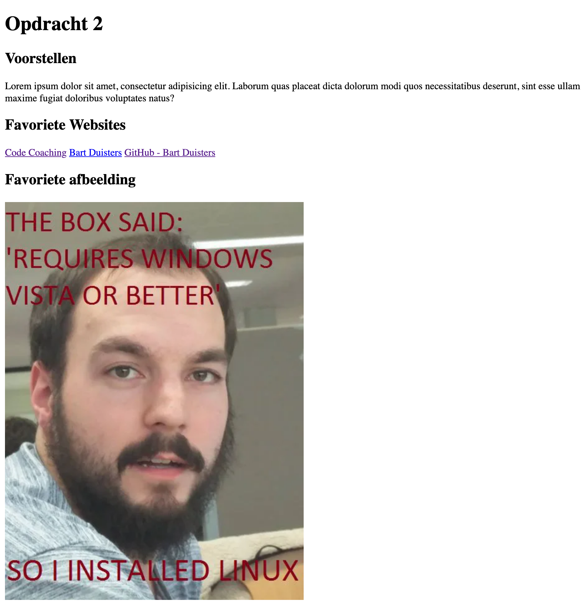
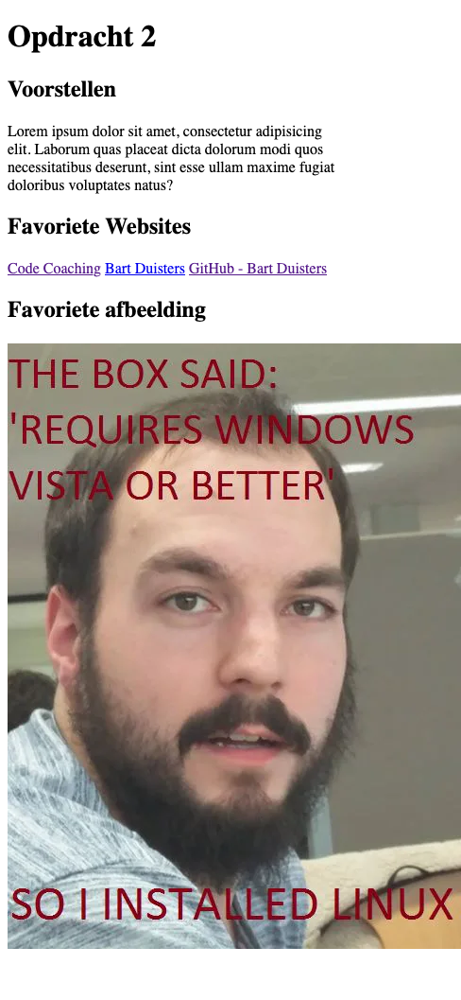

# Opdracht 1

Herinnering: de map `opdracht` is de `root` van de opdracht. Maak hierin de opdracht.

## Stappen

- Maak gebruik van de bestaande `index.html`-pagina.
- Plaats waar gevraagd een paragraaf met wat tekst waarin je jezelf voorstelt. /1
- Plaats waar gevraagd drie links naar jouw favoriete websites. /1
- Plaats waar gevraagd een afbeelding van jouw favoriete afbeelding. /1
    - Extra: Voorzie het SEO-vriendelijke attribuut op de afbeelding. /1

## Resultaat

### Desktop

### Mobile

