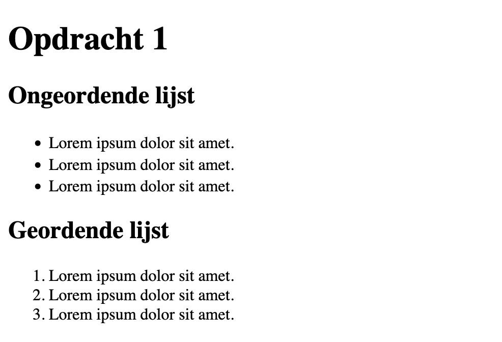

# Opdracht 1

Herinnering: de map `opdracht` is de `root` van de opdracht. Maak hierin de opdracht.

## Stappen

- Maak gebruik van de bestaande `index.html`-pagina.
- Plaats waar gevraagd een Ordered List met drie items. /1
- Plaats waar gevraagd een Unordered List met drie items. /1

## Resultaat

