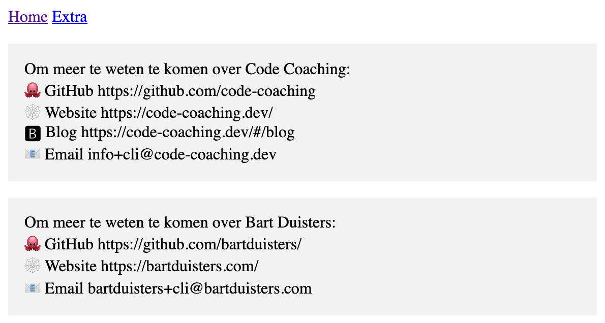
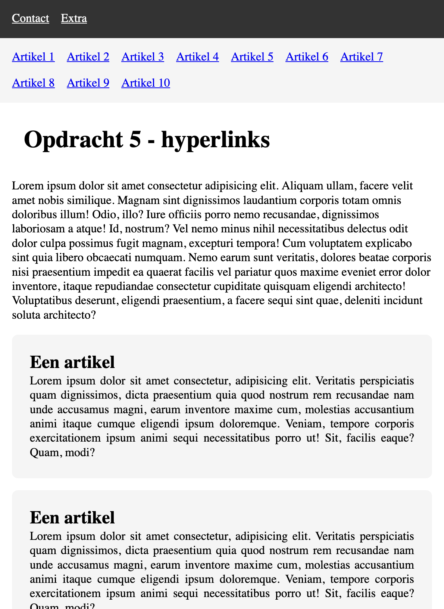
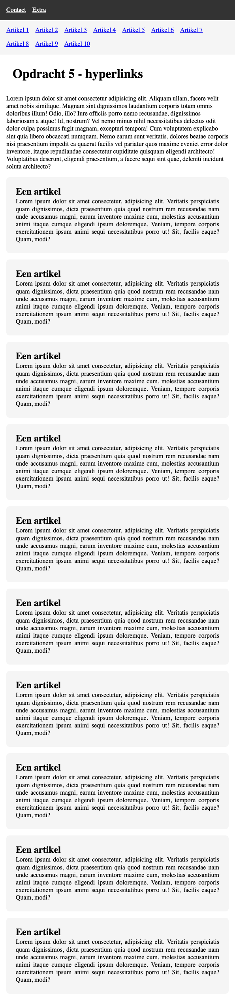

# Opdracht 1

Herinnering: de map `opdracht` is de `root` van de opdracht. Maak hierin de opdracht.

Alle styling is voorzien, het is niet nodig om CSS toe te voegen.

## Theorievraag

Wat is het verschil tussen niet-semantische HTML en semantische HTML? /1
Maak duidelijk met een voorbeeld. /1

Antwoord: Semantische HTML bestaat uit elementen die omschrijven waarvoor het element dient. Niet-semantische HTML bestaat uit elementen met een generieke naam.
Bijvoorbeeld: `
` is een niet-semantisch HTML-element, `div` omschrijft niet wat er als inhoud aanwezig zal zijn. `<article>` is een semantisch HTML-element, `article` omschrijft wat de inhoud zal zijn - een artikel.

## Stappen

- Maak gebruik van de bestaande `index.html`-pagina.
- Koppel in `index.html` koppelingen naar de artikels. Wanneer er op een artikel geklikt wordt, moet de pagina de focus op het geklikte artikel plaatsen. /2
- Koppel in `contact.html` links naar de `index.html`, de inhoud van deze link is `Home`. /1
- Voeg een extra pagina toe genaamd `extra.html`, voorzie hier een geldige HTML-basisstructuur en navigatie naar de andere pagina's (`index.html`, `contact.html`). /3
- Voeg de extra pagina toe als link in de navigatiebalk van de `index.html`. /1
- Voeg de extra pagina toe als link in de navigatiebalk van de `contact.html`. /1

## Resultaat

### extra.html

### contact.html

### index.html

#### zichtbaar

#### volledig

